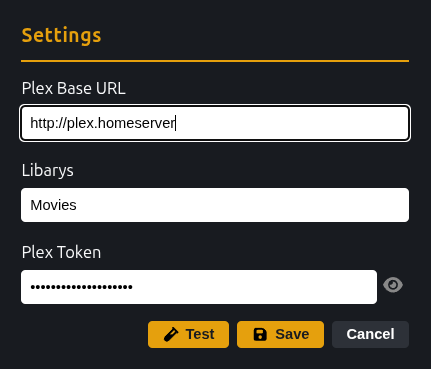
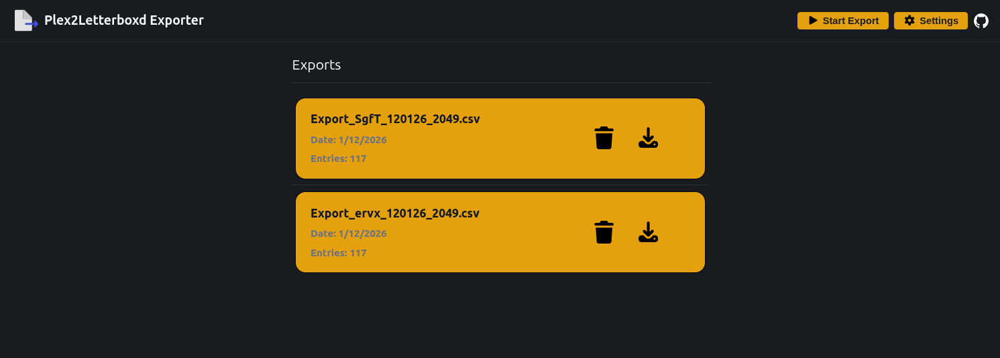

# Plex2Letterboxd-frontend


<p align="center">
  
  
</p>


For years I have been using this good old Python script from [mtimkovich](https://github.com/mtimkovich) — kudos to him! But since I run it every month, I tend to forget how to use it or sometimes run into weird errors.... That’s why I built this frontend wrapper that uses his tool behind the scenes and lets me deploy it next to Plex. Now I can just open this simple webapp every now and then and do my job with two clicks, instead of fussing around with Python all over again. If a feature is missing let me know :) 


<p align="center">
 
</p>
<p align="center">
 
</p>


Features:
* Shows all past exports
* Test your Plex API
* Configure which libary to export
* Saves settings


ToDo:
* Errorhandling
* Custom export naming

## How to

After generating CSV login to [letterboxdImport](https://letterboxd.com/import/)) to import it!

### Via Docker (recommended)
Execute this to start frontend app in your selfhosted environment or local machine which runs docker.

 ```bash
docker run -d \
  -p 5670:80 \
  --name plex2letterboxd-frontend \
  -v plex2letterboxd_config:/app/script \
  -v plex2letterboxd_data:/app/data \
  --restart unless-stopped \
  ghcr.io/maxiking445/plex2letterboxd-frontend:latest
```
You can now open [http://localhost:5670](http://localhost:5670)


### Build Docker Locally

 ```bash
docker compose build --no-cache
docker compose up
```

You can now open [http://localhost:5670](http://localhost:5670)

### Install without Docker

Node 22 required
Go 1.23 required

Install Pyhton
 ```bash
cd backend/script
python -m venv env
source env/bin/activate
pip install .
```
Install npm
 ```bash
cd frontend
npm install
npm run dev
```

Install Go
 ```bash
cd backend
go mod tidy
make run
```
